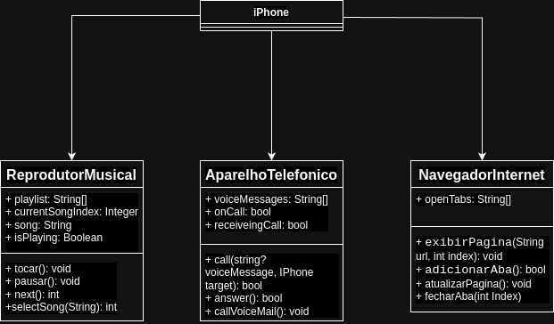

# Java Basic Challenge

This project is part of the Java Basic Challenge from Digital Innovation One. The challenge involves creating a Java application using Object-Oriented Programming (OOP) principles.

## Project Structure

- **src/main/java/org/example/Main.java**: The main entry point of the application.
- **src/test/java/org/example/MainTest.java**: Unit tests for the application.
- **pom.xml**: Maven configuration file.

## UML Diagram

The following UML diagram illustrates the structure of the project:



## Requirements

- Java 21
- Maven

## Running the Application

To run the application, use the following Maven command:

```sh
mvn clean install
mvn exec:java -Dexec.mainClass="org.example.Main"